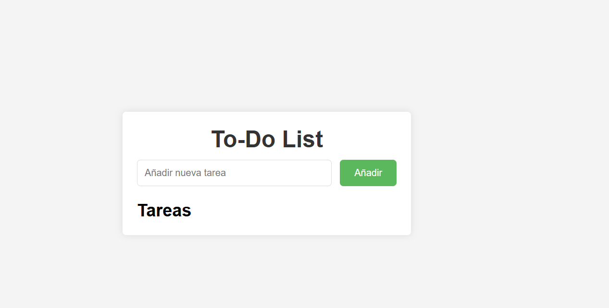
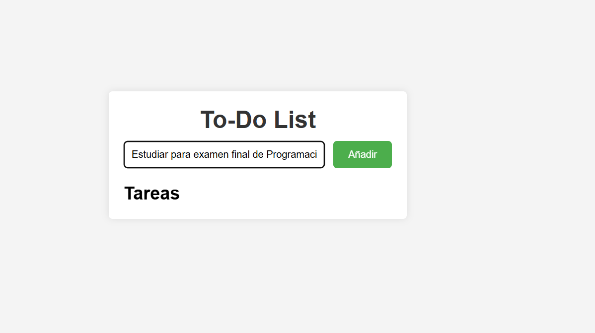
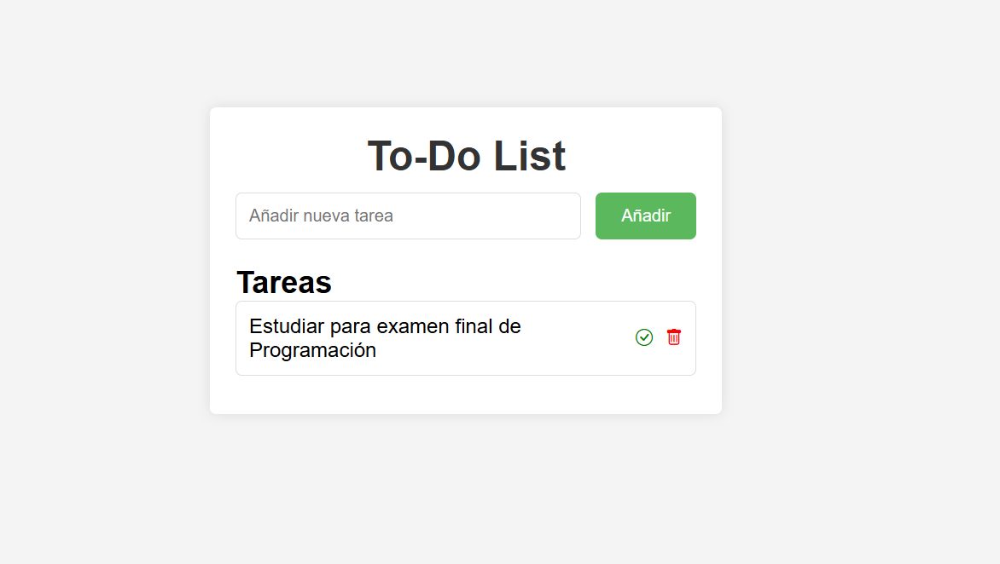

# To-Do List

Una sencilla aplicación de lista de tareas desarrollada con HTML, CSS y JavaScript. Esta aplicación permite a los usuarios añadir, completar y eliminar tareas de una lista.

## Funcionalidades

- **Añadir Tarea**: Permite a los usuarios agregar nuevas tareas a la lista.
- **Completar Tarea**: Los usuarios pueden marcar las tareas como completadas. Las tareas completadas se muestran con un estilo tachado y en color gris.
- **Eliminar Tarea**: Los usuarios pueden eliminar tareas de la lista después de una confirmación.

## Tecnologías Utilizadas

- HTML
- CSS
- JavaScript
- Bootstrap Icons

